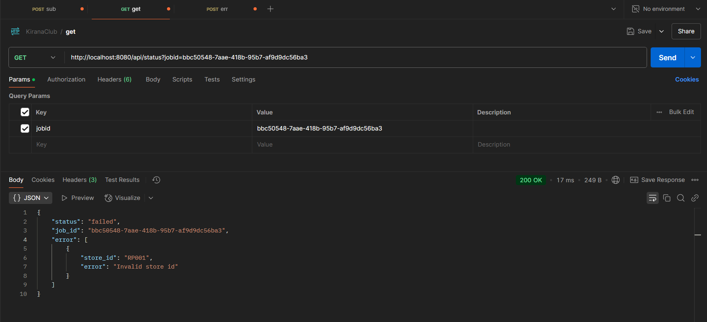

# Storeit Image Processing Service

## Description

The Storeit Image Processing Service is a backend application written in Go that processes images collected from various retail stores. The service accepts a job submission with a list of store visits, each containing a store ID, one or more image URLs, and an optional visit time. For each image, the service downloads the image, calculates its perimeter (using the formula `2*(Height+Width)`), and simulates GPU processing with a random delay between 0.1 and 0.4 seconds. The processed results are stored at the image level. The job status (ongoing, completed, or failed) can be retrieved via an API endpoint.

## Assumptions

- **Store Validation:** The service validates the provided `store_id` against a pre-populated MongoDB collection (imported from a CSV file of store master data). If a `store_id` is not found, the job is marked as failed.
- **Visit Time:** The `visit_time` field in the job submission is optional. If omitted, the current timestamp is automatically assigned.
- **Image Download and Processing:** If an image download or processing fails, the job error is recorded, and the job status is updated to "failed". Otherwise, if all images process successfully, the job status is updated to "completed".
- **Concurrency:** The service uses Go goroutines to process jobs in the background to handle multiple jobs concurrently.
- **Environment:** The application uses Docker and Docker Compose to run alongside a MongoDB instance.

## Installing and Testing Instructions

### Prerequisites
- [Go](https://go.dev/doc/install)
- Store Master data (StoreMasterAssignment.csv) to be prepopulated within mongodb instance with collection name 'store_master'
- [VS Code](https://code.visualstudio.com/download)
- [Postman](https://www.postman.com/downloads/)
- [Docker](https://www.docker.com/get-started) and [Docker Compose](https://docs.docker.com/compose/install/) installed on your machine.
- (Optional) MongoDB Compass for verifying database content.

### Setup

1. **Clone the Repository:** (If using git)

   ```bash
   git clone https://github.com/SoNiC-HeRE/StoreIt
   cd Storeit
   ```

   or
   **If using rar file** 
   
   ```bash
   extract provided rar file and cd into it 
   ```


2. Configure Environment Variables:
Create a .env file in the root directory with the following content:

    ```bash
    MONGO_URI=''
    ```

3. Import the Store Master CSV Data:

    Use a tool like MongoDB Compass to import your CSV data (StoreMasterAssignment.csv) into the store_master collection in MongoDB. The CSV should contain columns for store_id, store_name, and area_code.

4. Build and Run the Application: (Docker)
    Make sure docker engine is running.
    Run the following command to build and start the services using Docker Compose:

    ```bash
    docker-compose up --build
    ```
This will build the Go application (using a Go 1.20 base image) and start a MongoDB container. Your application will be accessible at http://localhost:8080.

5. Build and Run the Application: (Go)

    Run the following command to build and start the services using Docker Compose:

    ```bash
    go mod tidy
    go run main.go
    ```
Wait for some time and your application will be accessible at http://localhost:8080.

### Testing
Submit a Job:

Use Postman or curl to send a POST request to:

```bash
POST http://localhost:8080/api/submit/
```

Request Payload Example:
(NOTE: Passed store id should match one of the store id provided in csv else req will fail)

```json
{
   "count": 2,
   "visits": [
      {
         "store_id": "RP00001",
         "image_url": [
            "https://www.gstatic.com/webp/gallery/2.jpg",
            "https://www.gstatic.com/webp/gallery/3.jpg"
         ],
         "visit_time": "2025-03-10T12:00:00Z"
      },
      {
         "store_id": "RP00002",
         "image_url": [
            "https://www.gstatic.com/webp/gallery/3.jpg"
         ]
      }
   ]
}
```

If any store_id is invalid, the response will be:

```json
{
    "status": "failed",
    "job_id": "",
    "error": [
        {
            "store_id": "RP00001",
            "error": "Invalid store id"
        }
    ]
}
```
Otherwise, a valid job submission will return:

```json
{
    "job_id": "generated-job-id"
}
```

Get Job Status:

Retrieve the status of a job with:

```bash
GET http://localhost:8080/api/status?jobid=generated-job-id
```

The response will include the job status (ongoing, completed, or failed) along with any error details if the job failed.

### Work Environment
- Operating System: Developed and tested on Windows 11.
- Computer Specs:
    - Processor: AMD Ryzen 5 
    - Memory: 8GB RAM
- Text Editor/IDE: Visual Studio Code, Postman and Docker Desktop.
- Libraries and Tools:
    - Go: Version 1.20 (compiled using Docker with Go 1.20-alpine image)
    - Gin: For HTTP routing and middleware
    - MongoDB: For database storage
    - Docker & Docker Compose: For containerization and environment orchestration
- MongoDB Compass: (Optional) For visual database management

### Future Improvements
- Enhanced Error Reporting: Implement detailed logging and error reporting (e.g., storing error messages for each failed image in the database).
- Worker Pool: Implement a worker pool for concurrent image processing to efficiently handle thousands of images.
- Rate Limiting & Security: Add rate limiting and authentication/authorization for the API endpoints.
- Testing: Add unit and integration test coverage for the application.
- Configuration Management: Use a configuration library (e.g., Viper) for more flexible configuration management.
- Monitoring: Integrate monitoring and alerting (e.g., Prometheus, Grafana) to track job processing metrics and system performance.
- Scalability: Explore container orchestration (e.g., Kubernetes) for horizontal scaling as the load increases.

### Working Demo:
1. [Using Go CLI](https://www.loom.com/share/0067c70d84ca47118c444aa9ab179043)

2. [Using Docker](https://www.loom.com/share/880918d8396d4063b49e55b4e4aec6ae)

### Screenshots:
- POST Req (Success):


- POST Req (Count and Len mismatch):


- POST Req (Missing store id field):


- POST Req (Missing image_url field):


- GET Req (Success):


- GET Req (Invalid Store Id):



- GET Req (Invalid Image Url):


- GET Req (Invalid Job Id):


- MongoDB Collections:
    - Images

    

    - Jobs

    

    - Store Master (Imported data from csv)

    
<hr/>